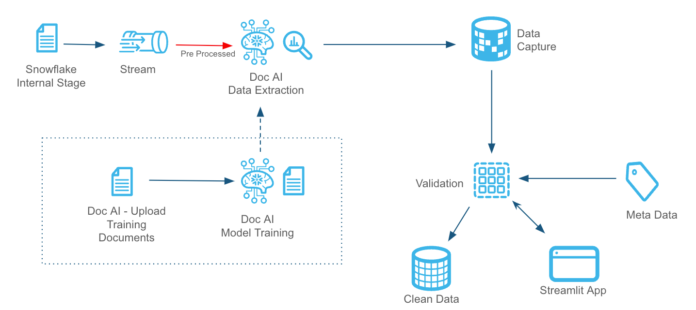

# Document AI Integration with Snowflake  

## Overview  

Organizations handle a vast number of documents from various vendors, departments, and external sources, integrating them into internal systems. These documents often contain critical data required by downstream systems. Many businesses rely on manual or semi-automated processes that are inefficient and require significant human intervention.  

This solution **fully automates the end-to-end data extraction process** using **Document AI models** tailored to different PDF formats, integrating with **Snowflake** for structured storage and leveraging metadata for model and score management.  

## Solution Components  

The architecture consists of multiple components working together to efficiently process, extract, and validate data from PDFs:  

- **📄 Document AI Models** – Custom-trained models to extract structured information from PDFs.  
- **🗂 Metadata Management** – Centralized tables to manage model configurations, extracted data scoring, and processing rules.  
- **✅ Pre-Processing (Gatekeeper Process)** – A Python-based validation layer to filter and approve documents before processing.  
- **🔄 ETL Pipeline** – Handles data extraction, transformation, and validation to ensure high-quality structured output.  
- **🖥 Streamlit UI** – A web-based interface for managing models, tracking processes, handling exceptions, and enabling reprocessing.  

This automated pipeline enhances efficiency, reduces manual workload, and ensures accurate and scalable document processing within **Snowflake**. 🚀  

# Steps to Replicate the Setup

## Create a Document AI Model

1. Navigate to **Snowsight → Document AI**.
2. Create a new model and name it **Invoice_model**.
3. Upload training PDFs (use a couple of documents from the sample directory in the GitHub repository).  
   - In real-world scenarios, at least **20 documents** are recommended for better results.

## Extract the Following Values from Document AI:

- **AMOUNT**
- **DISCOUNT**
- **INVOICE_DATE**
- **INV_NUMBER**
- **ITEM_DESCRIPTIONS**
- **PO_NUMBER**
- **QUANTITY**
- **RATE**

## Download the Required Scripts

- All scripts are available in the **GitHub Repository**.
- Download the repository to access all necessary scripts.

## Create Snowflake Internal Stages

- `@invoice_doc` - The source stage where incoming PDF documents land.
- `@manual_review` - Documents that fail pre-filter validation are moved here for manual review.
- `@ignored_docs` - Documents that are deemed unfit for Document AI processing are stored here.

## Create a Snowflake Warehouse

- Create a warehouse named **DS_DEV_WH** for processing tasks.

## Execute the QuickStart SQL Script

1. Load the **DOC_AI_QuickStart.SQL** file from the GitHub repository into Snowflake **Snowsight**.
2. Execute the script to create all necessary database objects, including:
   - Tables
   - Views
   - Streams
   - Stored Procedures
   - Tasks
3. This script will also create a database named **DS_DEV_DB** along with the required schemas.

## Insert Metadata

- Insert the extracted values from the **Document AI model training** into the score threshold table.

## Enable Scheduled Processing

1. Navigate to **DS_DEV_DB → Tasks** in **Snowsight**.
2. Resume the **Extract_data** and **Preprocessing** tasks.
   - The **Extract_data** task includes a chain of dependent tasks.
3. By default, the **prefilter** and **extract_data** tasks run **every minute**.
   - Modify the schedule as needed.

## Load Sample Documents

1. Download sample documents from the `sample_docs` directory.
2. Upload them to the source stage **@invoice_docs** for processing.

## Deploy Streamlit UI

1. In **Snowsight**, create a new **Streamlit** application.
2. Edit the Streamlit app, copy the code from `Streamlit-in-Snowflake.py`.
3. Paste the copied code into the **Streamlit editor** and execute it.

## Monitor the Document Processing Flow

1. Start the processing tasks to initiate the document flow.
2. Use the **Streamlit app’s live view** to monitor document movement through the pipeline.
